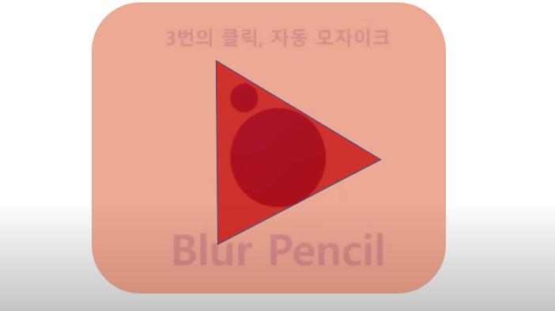
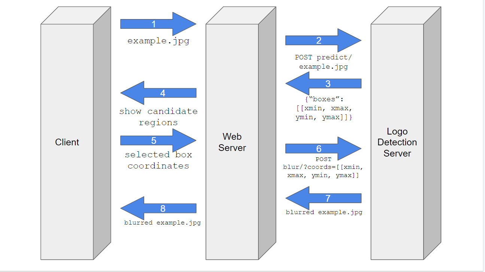
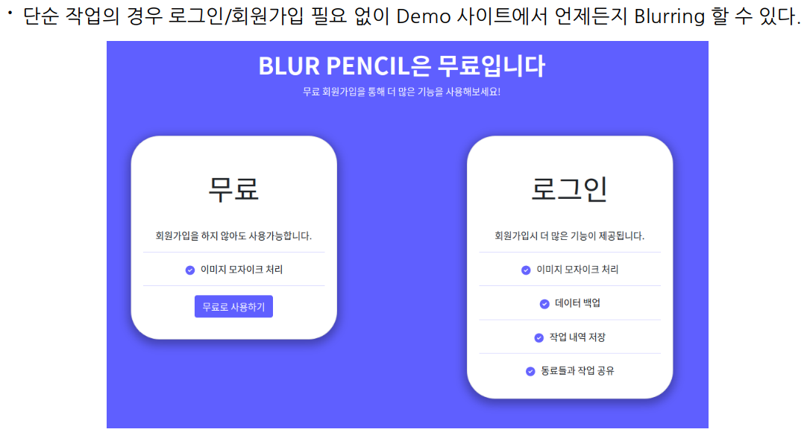
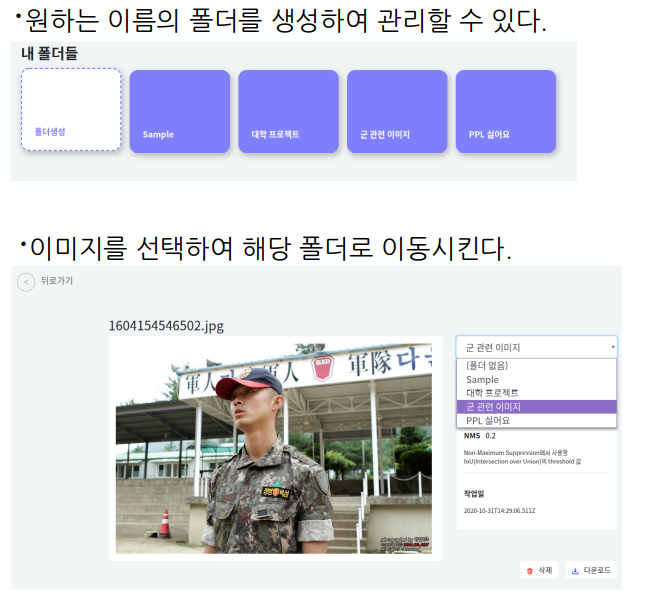
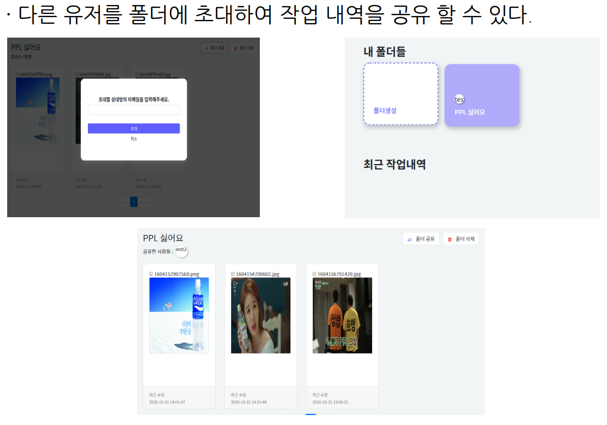
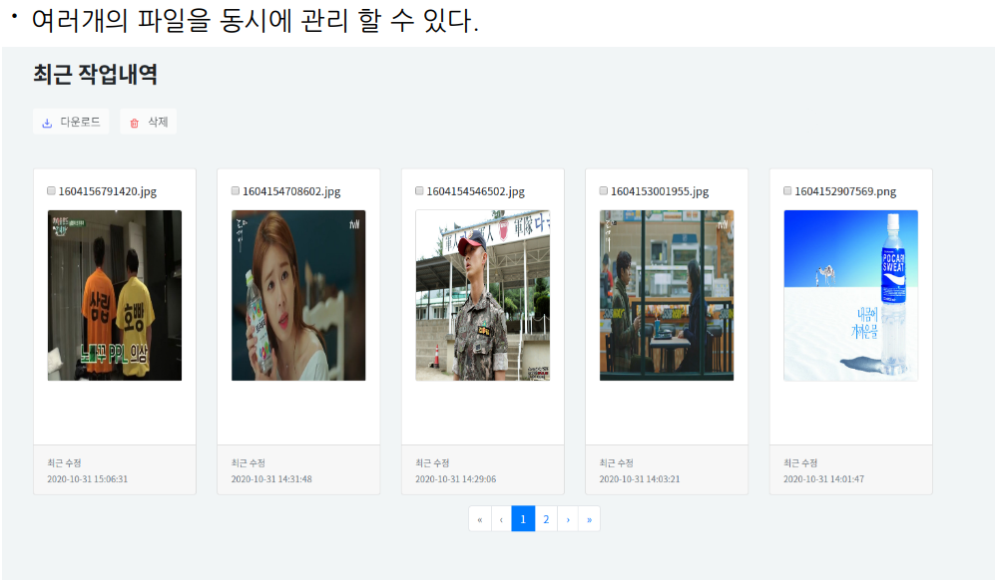

<p align="center">
  
</p>
<br/>
<p align="center">
  자동 검열 모자이크 서비스, <strong>BLUR PENCIL</strong>
  <br/>  
 빠르고 편리한 자동 검열 기능을 통해 취약한 보안을 강화하고 저작권 침해를 예방합니다.
</p>

<p align="center">
 
 
 
</p>

<p align="center">
 
 <a href="http://20.194.22.218:8080/">
 	
 </a>
</p>

<!-- 
//깃헙 레포 코드 용량

//깃헙 레포 닫힌 이슈 개수

//깃헙 PR

-->

## 프로젝트 소개 및 동영상
<!-- 마땅히 넣어 볼게 없어서 당장 심심해 보여 넣습니담.. 넣어두 되려나 모르겠네여 -->

<br>
<p><strong>Blur Pencil</strong>은 Blur와 Pencil을 합친 단어로, 모자이크 처리 하고 싶은 이미지를 Pencil(연필)과 같은 우리에게 익숙한 도구로 간단하고 쉽게 Blur처리 하기 위해 고안한 아이디어 입니다. 접근하기 편리한 웹을 통해 이미지를 드래그 앤 드랍만 하면, 학습된 Blur Pencil이 이미지를 분석한 뒤, 모자이크 할 객체를 인식하며, 인식된 객체 중 원하는 객체를 골라 모자이크 처리를 할 수 있습니다. 또한 모자이크 처리 된 이미지 내역들을 저장할 수 있으며, 다른 사용자와 공유할 수 있도록 도와줍니다.</p>

<br><br>

<table>
	<tr>
		<td>
			<a href="https://www.youtube.com/watch?v=Dpo0IvrmeTA&feature=youtu.be"></a>
		</td>
		<td>
			<a href="https://github.com/osamhack2020/Cloud_BlurPencil_GonNyong4/blob/master/PPT/Blur%20Pencil%20%EB%B0%9C%ED%91%9C%EC%9E%90%EB%A3%8C.pptx"></a>
		</td>
	</tr>
	<tr>
		<td align="center">
			<b>소개 영상</b>
		</td>
		<td align="center">
			<b>발표 자료</b>
		</td>
	</tr>
</table>

<br>
<br>

## 팀 정보 (Team Information)
<!--
- 팀장: 김현재 (hyeonjae.dev@gmail.com) | [Github](https://github.com/hughesgoon)
- 팀원(Full stack): 강예찬 (kyechan99@gmail.com) | [Github](https://github.com/kyechan99) 
- 팀원(Front-End): 배성준 (clcc001@naver.com) | 
- 팀원(Pytorch, CV): 홍승표 (spkbk98@gmail.com) | [Github](https://github.com/seungpyo) 
-->
<table>
  <tr>
    <td align="center">
     <a href="https://github.com/hughesgoon">
      
      <br />
      <sub>
       <b>김현재</b>
      </sub>
     </a>
     <br />
      <sub>
       <b>팀장</b>
      </sub>
     <p>hyeonjae.dev@gmail.com</p>
   </td>
    <td align="center">
     <a href="https://github.com/kyechan99">
      
      <br />
      <sub>
       <b>강예찬</b>
      </sub>
     </a>
     <br />
      <sub>
       <b>팀원(Full Stack)</b>
      </sub>
     <p>kyechan99@gmail.com</p>
   </td>
    <td align="center">
     <a href="https://github.com/kyechan99">
      
      <br />
      <sub>
       <b>배성준</b>
      </sub>
     </a>
     <br />
      <sub>
       <b>팀원(Front-End)</b>
      </sub>
     <p>clcc001@naver.com</p>
   </td>
    <td align="center">
     <a href="https://github.com/seungpyo">
      
      <br />
      <sub>
       <b>홍승표</b>
      </sub>
     </a>
     <br />
      <sub>
       <b>팀원(Pytorch, CV)</b>
      </sub>
     <p>spkbk98@gmail.com</p>
   </td>
  </tr>
 </table>
 <br><br>

## Blur Pencil 기능 및 설계
### 구조


### 설계


Blur Pencil은 위와 같은 과정을 클릭 3번만으로 쉽게 작동할 수 있습니다.

## Blur Pencil 사용법
### STEP 1
<br>
<p>사진을 Drag and Drop해서 올린다.</p>

### STEP 2
<p>인식된 객체 중 모자이크 할 객체를 선택한다.</p>

### STEP 3
<p>모자이크 처리 된 이미지를 확인 후 다운로드 한다.</p>


## Blur Pencil이 가지는 장점
### 로그인 없이 무료로 사용 가능

<br>

### 폴더 기능
<p>작업한 이미지들을 폴더 별로 나누어 저장할 수 있으며 다른 유저와 공유도 할 수 있다.</p>

<strong>메인 페이지</strong>

<strong>폴더 저장</strong>

<strong>폴더 공유</strong>

<strong>파일 관리</strong>

<br><br>

## DEMO
<p align="center">
<p align="left">

### Demo Image 1

</p>

<p align="left">

### Demo Image 2

</p>

<p align="left">

### Demo Image 3

</p>

<p align="left">

### Demo Image 4

</p>

</p>

## Blur Pencil 기대 효과
<li>빠르고 편리한 자동 검열 기능을 통해 보안 취약점과 저작권 침해 등을 보완할 수 있다.</li>
<li>강력한 보안을 필요로 하는 개인이나 집단, 저작권 보호를 중요시하는 단체에게 Blur Pencil의 기술을 통해 업무 성능 향상을 도와준다.</li>
<li>인식률(score)과 NMS(Non-Maximum Suppression)을 조절하여 검열 대상의 인식률을 조절 할 수 있다.</li>
<li>계속해서 </li>

## 컴퓨터 구성 / 필수 조건 안내 (Prerequisites)
- 권장 : 최신 버전의 크로미움 기반 브라우저

## 기술 스택 (Technique Used)
### Server(back-end)
 - Node.js
 - Express
 - MongoDB
 - Flask
 - PyTorch
 
### front-end
 -  Vue.js
 -  Bootstrap

## 설치 안내 (Installation Process)
```bash
$ git clone https://github.com/osamhack2020/Cloud_BlurPencil_GonNyong4.git
```

### Back-End
```bash
$ cd server/
$ npm install
```

### Front-End
```bash
$ cd client/
$ npm install
```

### Build / Test
```bash
$ (root) npm start
```

### 세팅 유의 사항
1. [vue.config.js](https://github.com/osamhack2020/Cloud_BlurPencil_GonNyong4/blob/master/client/vue.config.js) 안에 '/api' `target` 주소를 서버주소(로컬 환경시 서버포트)로 변경
2. [main.js](https://github.com/osamhack2020/Cloud_BlurPencil_GonNyong4/blob/master/client/src/main.js) 안에 `serverUrl` 변수명을 서버주소(로컬 환경시 서버포트)로 변경

> 구름 IDE 환경으로 개발시 로컬 주소가 아닌 URL 주소를 직접 입력해 주어야함


## 저작권 및 사용권 정보 (Copyleft / End User License)
MIT License

Copyright (c) 2020 GONNYONG4

Permission is hereby granted, free of charge, to any person obtaining a copy of this software and associated documentation files (the "Software"), to deal in the Software without restriction, including without limitation the rights to use, copy, modify, merge, publish, distribute, sublicense, and/or sell copies of the Software, and to permit persons to whom the Software is furnished to do so, subject to the following conditions:

The above copyright notice and this permission notice shall be included in all copies or substantial portions of the Software.

THE SOFTWARE IS PROVIDED "AS IS", WITHOUT WARRANTY OF ANY KIND, EXPRESS OR IMPLIED, INCLUDING BUT NOT LIMITED TO THE WARRANTIES OF MERCHANTABILITY, FITNESS FOR A PARTICULAR PURPOSE AND NONINFRINGEMENT. IN NO EVENT SHALL THE AUTHORS OR COPYRIGHT HOLDERS BE LIABLE FOR ANY CLAIM, DAMAGES OR OTHER LIABILITY, WHETHER IN AN ACTION OF CONTRACT, TORT OR OTHERWISE, ARISING FROM, OUT OF OR IN CONNECTION WITH THE SOFTWARE OR THE USE OR OTHER DEALINGS IN THE SOFTWARE.
